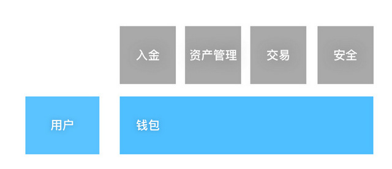

# Indexs of Fox.ONE OpenAPI 

> indexs for all foxone OpenAPI 

- https://fox.one/

Fox.ONE OpenAPI 项目是为了区块链钱包、资产及交易提供的一体化解决方案。

 
## ▎现实需求

基于区块链技术的新兴商户、平台及用户对支付交易解决方案有着迫切且相同的需求

* 钱包账户
* 资产管理
* 交易所
* 历史记录追溯
* 快速通知触达

 
## ▎方案及架构

Mixin 业务专注于底层区块链

生态合作伙伴负责领域创新

给出更合适、更易用的解决方案

 
## ▎OpenAPI 业务

- Wallet
    - Withdraw
    - Deposit 
    - Assets Overview
    - Transaction Record
- Exchange

 
## ▎OpenAPI SDK 使用：

- Golang: https://github.com/fox-one/fox-gateway-sdk
- iOS https://github.com/fox-one/foxone-ios-opensdk
- Android https://github.com/fox-one/foxone-android-opensdk
- Web & Node.js https://github.com/fox-one/foxone-js-opensdk

